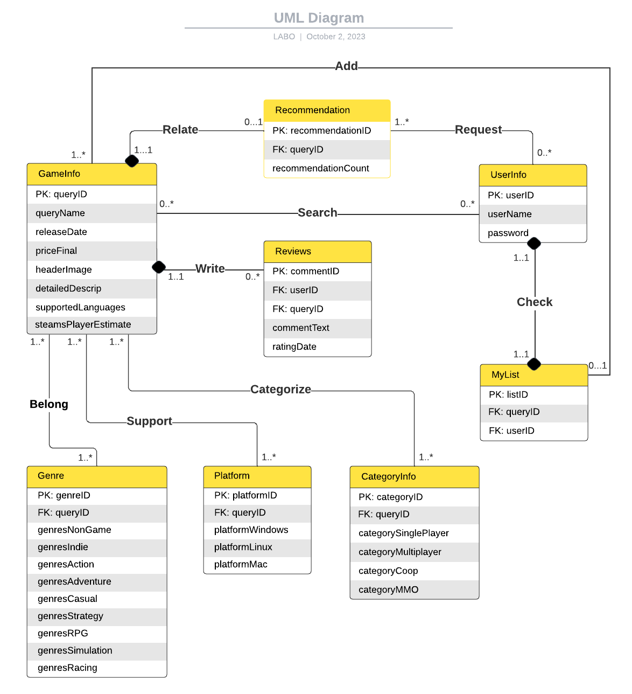

# Database Design

## UML diagram


## Entities
We have a total of 8 entities for our database design, and each is explained as follows

### 1. UserInfo
This is an entity regarding each user and their login information
1. **UserID**: a unique identifier to distinguish between users. It will be a string attribute and a primary key for this table,
2. **UserName**: a self-selected username by the user, a string attribute
3. **Password**: a password created by the user, a string attribute

This entity is designed with the following assumptions:
1. Every user in the platform has a unique UserID that cannot be modified.
2. Users can change their password, which will result in an update operation for this table.
3. Users cannot change their username
4. Once the user has entered their username, and password, and clicked login, they will be redirected to the home page.

### 2. GameInfo
This is an entity regarding each game and its necessary information. 
1. **QueryID**: 


## Relations
**1. Check**

- Check is a one-to-one relation between ```UserInfo``` and ```MyList```. User can check their own list to collect their favourite games.
- Assumption: Each user has only one favourite game list called “MyList”, and each list should correspond to one user.

**2. Request**

- Request is a zero or one-to-many relationship between ```Popularity``` and ```UserInfo```. A user can request a popular game recommendation.
- Assumption: Users may not request popularity recommendations. When they request, they will receive one recommendation, and a new recommendation will follow up if the previous one is rejected.  

**3. Write**

- Wrote is a one to zero or many relation between ```Reviews``` and ```GameInfo```. A user can write reviews for games.
- Assumption: A user can write multiple reviews, but a review must belong to one user. 

**4. Search**

- Search is a one to zero or many relation between ```GameInfo``` and ```UserInfo```. Users can search for the game that they are interested in.
- Assumption: Each user can search multiple times, and every search belongs to one user.

**5. Relate**

- Relate is a zero or one to one relation between ```Popularity``` and ```GameInfo```. The Popularity will recommend one of the most popular games and relate it with its game information.
- Assumption: Each popularity recommendation relates to one game information. Each game information may or may not relate to one popular recommendation. 

**6. Add**

- Add is a one-to-many relation between ```MyList``` and ```GameInfo```. Users can find the corresponding game information in the game list.
- Assumption: The MyList links to multiple game information. Each game information may or may not link to a list.


**7. Categorize**

- Categorize is a many-to-many relation between the ```GameInfo``` and ```CategoryInfo```. 
- Assumption: A game may be categorized into multiple categories. In one category, there are many different games. 

**8. Support**

- Support is a many-to-many relation between ```GameInfo``` and ```Platform```. 
- Assumption: A platform supports many different games. A game can also contain many different supporting platforms. 

**9. Belong**

- Belong is a many-to-many relation between ```GameInfo``` and ```Genre```. 
- Assumption: A game may belong to different genre categories. In one genre, there are many different games.


## Relational Schema
Here we will convert the database design into 11 tables

**1. UserInfo**
```mysql
UserInfo(
    userID VARCHAR(255) [PK],
    userName VARCHAR(255),
    password VARCHAR(255),
)
```

**2. GameInfo**
```mysql
GameInfo(
    queryID VARCHAR(255) [PK],
    queryName VARCHAR(255),
    releaseDate VARCHAR(255),
    priceFinal FLOAT,
    headerImage VARCHAR(255),
    detailedDescrip VARCHAR(255),
    supportedLanguages VARCHAR(255),
    steamspyplayerestimate INT
)
```

**3. Recommendation**
```mysql
Recommendation(
    recommendationID VARCHAR(255) [PK],
    queryID VARCHAR(255) [FK to GameInfo.queryID],
    recommendationCount INT
)
```

**3. Reviews**
```mysql
Reviews(
    commentID VARCHAR(255) [PK],
    userID VARCHAR(255) [FK to UserInfo.userID],
    queryID VARCHAR(255) [FK to GameInfo.queryID],
    commentText VARCHAR(255),
    ratingDate VARCHAR(255)
)
```

**4. MyList**
```mysql
MyList(
    listID VARCHAR(255) [PK],
    queryID VARCHAR(255) [FK to GameInfo.queryID],
    userID VARCHAR(255) [FK to UserInfo.userID]
)
```

**5. Genre**
```mysql
Genre(
    genreID VARCHAR(255) [PK],
    queryID VARCHAR(255) [FK to GameInfo.queryID],
    genrelsNonGame BOOLEAN,
    genrelsIndie BOOLEAN,
    genrelsAction BOOLEAN,
    genrelsAdventure BOOLEAN,
    genrelsCasual BOOLEAN,
    genrelsStrategy BOOLEAN,
    genrelsRPG BOOLEAN,
    genrelsSimulation BOOLEAN,
    genrelsRacing BOOLEAN
)
```

**6. Platform**
```mysql
Platform(
    platformID VARCHAR(255) [PK],
    queryID VARCHAR(255) [FK to GameInfo.queryID],
    platformWindows BOOLEAN,
    platformLinux BOOLEAN,
    platformMac BOOLEAN
)
```
**7. CategoryInfo**
```mysql
CategoryInfo(
    categoryID VARCHAR(255) [PK]
    queryID VARCHAR(255) [FK to GameInfo.queryID],
    categorySinglePlayer BOOLEAN,
    categoryMultiplayer BOOLEAN, 
    categoryCoop BOOLEAN,
    categoryMMO BOOLEAN
)
```

## MySQL DDL Commands

```mysql
# Entities

CREATE TABLE UserInfo (
    UserID VARCHAR(255) PRIMARY KEY,
    UserName VARCHAR(255),
    UserEmail VARCHAR(255),
    Password VARCHAR(255)
);
