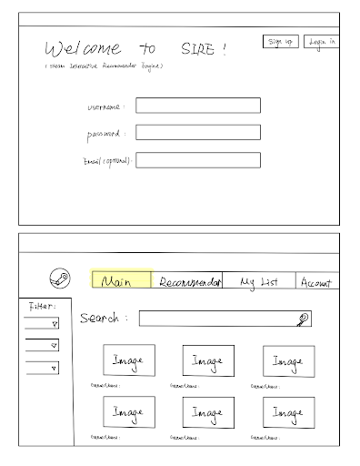
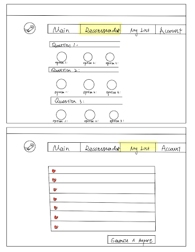
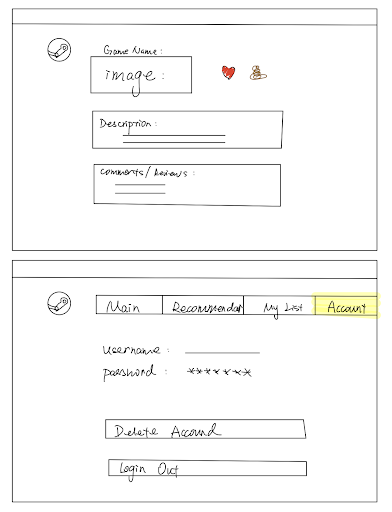

# Steam Interactive Recommender Engine

## Project Summary

The Steam Interactive Recommender Engine is a novel addition to the Steam platform, designed to redefine the game discovery experience. By harnessing a dynamic filtering system, it allows users to sift through games based on their individual preferences, ensuring they find titles that resonate with their interests. The system's intuitive interface simplifies the selection process, allowing gamers to effortlessly uncover gems within the vast Steam library.

In tandem with its recommendation capabilities, the engine incorporates seamless registration and login functionalities, creating a personalized journey for every user. As the platform looks to future enhancements, the focus remains clear: delivering a seamless, user-centric interface that makes game exploration both enjoyable and efficient. Through this approach, the Steam Interactive Recommender Engine is set to become an indispensable tool for gamers on the

## Description

SIRE aims to revolutionize the user experience on the Steam gaming platform. We want to provide personalized game recommendations based on individual gameplay preferences. This ensures users find games that align with their tastes, effectively simplifying their game search process.

Key Features:

- User Experience: With an intuitive registration and login process, SIRE ensures a tailored experience from the outset. Every user, whether new or returning, can navigate the platform with ease, accessing recommendations curated just for them.
- Recommendation System: At the heart of SIRE is its state-of-the-art recommendation engine. By processing vast amounts of data, it accurately predicts games that users are likely to enjoy. Moreover, users can explore popular games tailored to specific criteria, ensuring they always discover quality content.
- Community Engagement: Beyond game recommendations, SIRE values its community. Users can rate and review games, creating a rich repository of feedback. This not only guides fellow gamers in their choices but also provides developers with critical insights.

In essence, the Steam Interactive Recommender Engine is a confluence of technology and user-centric design, set to redefine how gamers discover and engage with content on Steam.

## Usefulness

The Steam Interactive Recommender Engine (SIRE) serves a significant need in the vast digital landscape of gaming, particularly within the Steam gaming platform. As the number of games on Steam continues to rise, discovering games that resonate with individual preferences can be an overwhelming task for gamers. SIRE aims to alleviate this problem by delivering personalized game recommendations based on user gameplay history and specific preferences, enhancing the gaming experience and ensuring players find content that truly aligns with their tastes.

There are indeed other recommendation systems in place on various platforms, including Steam's native recommendation feature. However, these traditional systems tend to emphasize newer game releases. This approach, while commercially logical to promote new content and drive sales, might not always be in the best interest of gamers looking for games that match their unique preferences. There's a notable difference in recommending a game because it's new and suggesting a game because it aligns closely with a user's likes and gameplay history.

The differentiator for SIRE lies in its pure intent: it recommends based on genuine user preferences without giving undue weight to new releases. This ensures that the recommendations are free from the potential bias of advertising or promotion of new games, thus offering a more tailored and genuine list of game suggestions.

Additionally, while there are other game recommendation platforms and tools available, none combine the comprehensive range of functionalities offered by SIRE. Features like the "Popular Games Tendency" allow users to track trending games based on specific time frames, giving a more dynamic insight into game popularity. The "Game Review & Community Feedback" function adds another layer of personal touch, ensuring that users can benefit from the collective wisdom of the Steam community.

In summary, the Steam Interactive Recommender Engine stands out in the gaming recommendation space due to its user-centric approach. By prioritizing genuine user preferences and integrating community feedback, it promises a more personalized and authentic game discovery experience, setting it apart from other similar platforms or tools.

## Realness

We decided to use Steam Game Data from data.world (https://data.world/craigkelly/steam-game-data), as it offers comprehensive information on various games and software available. It consists of 13,357 rows and 78 columns covering multiple aspects like basic product identifiers, characteristics counts, technical requirements, pricing, genres, reviews, and support details. This extensive data set encompasses everything from platform-specific requirements and pricing to genres, reviews, and even support and legal information, making it a valuable resource for deeper analysis or updates on Steam's gaming and software offerings.

Basic Information:
- QueryID, ResponseID: Identifiers/Index
- QueryName, ResponseName: Game/software names
- ReleaseDate: Initial release date of the product
- RequiredAge: Required age of the product

Characteristics Count (Numeric Count) & Content Metrics:
- DemoCount, DeveloperCount, DLCCount, MovieCount, PackageCount, PublisherCount, ScreenshotCount, etc.: Numeric count of different characteristics or topics.

Technical & System Requirements (Binary Variables with TRUE/FALSE):
- Controller Support, Single Player, Multi player 
- Platform specifics (Windows, Linux, Mac)
- Minimum and Recommended requirements for each platform

Pricing & Currency:
- Price (Initial, Final)
- Currency

Genres & Categories:
- Genre information (Indie, Action, Adventure, etc.)
- Category details (Single-player, Multiplayer, VR support, etc.)

Descriptions & Reviews:
- AboutText, ShortDescrip, DetailedDescrip, Reviews, DRMNotice, etc.

Support & Legal:
- SupportEmail, SupportURL, LegalNotice

Miscellaneous:
- HeaderImage, Background: Images that represents the game/software
- Website: Official site link for deeper dives or official updates
- SupportedLanguages: Languages in which the game/software is available

## Functionality

The core function of our web application lets users search for games by name, generating detailed results that include the game's description, images, costs, and reviews. A separate panel allows users to apply filters such as PC compatibility, genres, and price for a more customized search experience. After authenticating through a username and password, users can personalize their experience by liking or disliking games, adding public reviews, and curating lists of favorite games. Our most advanced feature aims to further personalize game discovery by incorporating a quiz-like functionality that suggests games based on user responses, helping connect players with titles that are likely to interest them.

A. Create Account Function:
- Function Name: createAccount
- Purpose: To allow new users to register an account in the software.
- Description:
    - The function starts by validating the input parameters. If any of the inputs are not valid, it returns an error message. If the inputs are valid, it checks if a user with the provided username or email (if used) already exists. If the user already exists, it returns a corresponding error message. If the username and email are unique, it hashes the password and stores the username, hashed password, email, and any other provided details in the database. On successful storage, it returns a success message.

B. Login Function:
- Function Name: login
- Purpose: To allow existing users to authenticate and gain access to the software.
- Description:
    - The function starts by validating the input parameters. If any of the inputs are not valid, it returns an error message. If the inputs are valid, it retrieves the hashed password for the provided username from the database. If no user with the provided username is found, it returns an "Invalid username or password" error. If a user is found, it compares the hashed version of the provided password with the stored hashed password. If they match, it returns a success message and establishes a session or returns a session token. If they don't match, it returns an "Invalid username or password" error.

C. Game Recommendation Function:
- Function Name: recommendGames
- Purpose: To recommend games to a player based on specified criteria such as game price, multiplayer options, currency, platform compatibility, and release date.
- Description:
    - The function starts by validating the input parameters. If any of the inputs are not valid, it returns an error message. Next, the function constructs a query to filter the game dataset based on the provided criteria. If a criterion is not provided, the function will not filter based on that criterion. For example, if no platform is provided, the function will return games for all platforms. The function will then sort the results based on relevance and other potential metrics like game ratings or popularity.
- Finally, it returns the top numRecommendations games (default could be set to 10 or any other number) that match the provided criteria.

D. Popular Games Tendency
- Function Name: Popular Games Tendency
- Purpose: Allow users to find the most popular games that were released at a chosen time 
- Description: 
    - The Steam Popularity Tendency Function offers gamers and researchers an intuitive and tailored method to discover popular games on the Steam platform. Whether a user is looking for trending titles in a specific year or wants to explore the best-rated games within a certain budget or genre, this tool provides a comprehensive and user-friendly solution. The integration of metrics like the recommendation count and SteamSpyOwners ensures that the recommendations are based on both qualitative and quantitative measures of popularity.

E. Search, Filter, Sort
- Function Name: findGame
- Purpose: Allow users to find game based on input
- Description: 
    - The search and sort algorithm will be implemented in the form of a search bar, and the filtering functionalities will be on the side bar
 
F. Save Game
- Function: saveGame
- Purpose: To allow users to save games that they might be interested in into a list 
- Description: 
    - Users can either give the emotes “heart” or “poop” to demonstrate whether or not they enjoy the game. These games will then be save onto a list. 

G. Game Description
- Function: Game Information
- Purpose: To provide users with an in-depth overview of a game, ensuring they have a comprehensive understanding of its content, storyline, and features
- Description: 
    - The Game Information Hub offers a deep-dive into the essence of a game, ensuring that users have all the details they need at their fingertips. Whether they're familiar with the game's world or are just discovering it, this feature enriches their understanding and aids in making informed decisions regarding gameplay or purchase.

H. Game Review & Community Feedback
- Function Name: Rate your Game
- Purpose: Allow users to share their experience, insights and ratings for games, creating a rich repository of user-generated content that aids others in making informed decisions.
- Description: 
    - The Game Review & Community Feedback System provides a platform for users to voice their opinions, share experiences, and influence the broader community's perception of a game. This not only promotes user engagement and trust in the platform but also provides valuable feedback to game developers. New or undecided users can leverage these reviews to make better purchasing decisions, ensuring satisfaction and reducing potential refund requests.

## Low Fidelity UI Mockup

## Project Work Distribution

The team will collectively work on backend and frontend, so we can all expand out full-stack abilities. However, we will be working individually to complete certain functionalities.

Xinzhe Miao: User authentication, account login and logout feature

Serena Gong: Game reccomendation algorithm, search bar and filtering functionalities

Yuteng Gao: Popular games functionality, ability to save liked/disliked games into list

Yihan Jiang: Game review and community feedback feature
