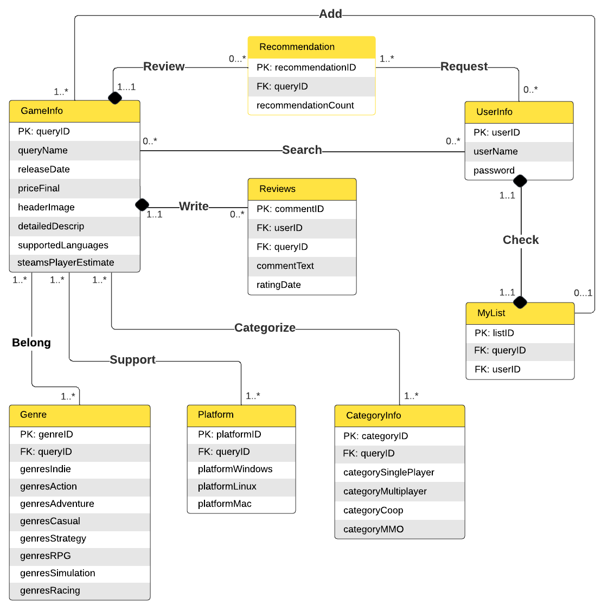

# Database Design

## UML diagram


## Entities
We have a total of 8 entities for our database design, and each is explained as follows

#### 1. UserInfo
This is an entity regarding each user and their login information
1. **userID**: a unique identifier to distinguish between users
2. **userName**: a self-selected username by the user, a string attribute
3. **password**: a password created by the user, a string attribute

This entity is designed with the following assumptions:
1. Every user in the platform has a unique UserID that cannot be modified.
2. Users can change their password, which will result in an update operation for this table.
3. Users cannot change their username
4. Once the user has entered their username, and password, and clicked login, they will be redirected to the home page.

#### 2. GameInfo
This is an entity regarding each game and its necessary information. 
1. **queryID**: a unique identifier to distinguish between games
2. **queryName**: the name for every game, a string attribute
3. **releaseDate**: the release date for a game, a string attribute
4. **priceFinal**: the cost of a game, a float attribute
5. **headerImage**: the link for an image of the game, a string attribute
6. **detailedDescription**: a description of the game, a string attribute
7. **supportedLangauges**: a list of languages the game supports, a string attribute
8. **steamPlayerEstimate**: the number of players for the steam game, an int attribute

This entity is designed with the following assumptions:
1. Every game will have a unique ID, but might not have a unique name. 
2. supportedLanguages might contain multiple languages seperated by a comma
3. steamPlayerEstimate will be utilised in this project to gauge popularity
        

#### 3. Recommendation
This is an entity where users can get recommendations for a game. 
1. **recommendationID**: a unique identifier to distinguish each recommendation
2. **queryID**: a unique identifier to distinguish between games
3. **recommendationCount**: the number of recommendations given by users in dataset, an int attribute

This entity is designed with the following assumptions:
1. Every recommendation is uniqely linked to a specific game via queryID
2. There will only be one game recommendation per recommendation request
3. The recommendation algorithm is based off of recommendationCount from the dataset  

#### 4. Reviews
This is an entity for users writing reviews about a game.
1. **commentID**: a unique identifier for every comment
2. **userID**: a unique identifier to distinguish between users
3. **queryID**: a unique identifier to distinguish between games
4. **commentText**: the review given by a user, a string attribute
5. **ratingDate**: the date of the review given by user, a string attribute

This eneity is designed with the following assumptions:
1. Every review is uniquely linked to a specific game via queryID
2. Users can write many reviews for a game, and this is only in text form
3. Each review is tied to a specific date 

#### 5. MyList
This is an entity a user's saved list of games.
1. **listID**: a unique identifier for every users list
2. **queryID**: a unique identifier to distinguish between games
3. **userID**: a unique identifier to distinguish between users

This entity is designed with the following assumptions:
1. Every user only has one distinct list
2. Users can add multiple games to the distinct list

#### 6. Genre
This is an entity about a games' genres
1. **genreID**: a unique identifier for the games' genres
2. **queryID**: a unique identifier to distinguish between games
3. **genresIndie**: if a game is indie or not, a boolean attribute
4. **genresAction**: if a game is action or not, a boolean attribute
5. **genresAdventure**: if a game is adventure or not, a boolean attribute
6. **genresCasual**: if a game is casual or not, a boolean attribute
7. **genresStrategy**: if a game is strategy or not, a boolean attribute
8. **genresRPG**: if a game is rpg or not, a boolean attribute
9. **genresSimulation**: if a game simulation or not, a boolean attribute
10. **genresRacing**: if a game is racing or not, a boolean attribute

This entity is designed with the following assumptions:
1. There is a predefined set of genres for a game that games either belong to or don't 
2. Each game can belong to multiple genres
   
#### 7. Platform
This is an entity about what platforms a game supports
1. **platformID**: a unique identifier for a games' supported platforms
2. **queryID**: a unique identifier to distinguish between games
3. **platformWindows**: if a game works on windows, a boolean attribute
4. **platformLinux**: if a game works on linux, a boolean attribute
5. **platformMac**: if a game works on mac, a boolean attribute

This entity is designed with the following assumptions:
1. Every game can have more than one supported platform

#### 8. CategoryInfo
This is an entity about the play styles of the game 
1. **categoryID**: a unique identifier for a games' supported categories
2. **queryID**: a unique identifier to distinguish between games
3. **categorySinglePlayer**: if a game has single player functionality, a boolean attribute
4. **categoryMultiplayer**: if a game has multiplayer functionality, a boolean attribute
5. **categoryCoop** if a game has co-op functionality, a boolean attribute
6. **categoryMMO**: if a game has MMO functionality, a boolean attribute

This entity is designed with the following assumptions:
1. Every game can be part of multple categories for play style


## Relations
**1. Check**

- Check is a one-to-one relation between ```UserInfo``` and ```MyList```. User can check their own list to collect their favourite games.
- Assumption: Each user has only one favourite game list called “MyList”, and each list should correspond to one user.

**2. Request**

- Request is a zero or one-to-many relationship between ```Popularity``` and ```UserInfo```. A user can request a popular game recommendation.
- Assumption: Users may not request popularity recommendations. When they request, they will receive one recommendation, and a new recommendation will follow up if the previous one is rejected.  

**3. Write**

- Wrote is a one to zero or many relation between ```Reviews``` and ```GameInfo```. A user can write reviews for games.
- Assumption: A user can write multiple reviews, but a review must belong to one user. 

**4. Search**

- Search is a one to zero or many relation between ```GameInfo``` and ```UserInfo```. Users can search for the game that they are interested in.
- Assumption: Each user can search multiple times, and every search belongs to one user.

**5. Relate**

- Relate is a zero or one to one relation between ```Popularity``` and ```GameInfo```. The Popularity will recommend one of the most popular games and relate it with its game information.
- Assumption: Each popularity recommendation relates to one game information. Each game information may or may not relate to one popular recommendation. 

**6. Add**

- Add is a one-to-many relation between ```MyList``` and ```GameInfo```. Users can find the corresponding game information in the game list.
- Assumption: The MyList links to multiple game information. Each game information may or may not link to a list.


**7. Categorize**

- Categorize is a many-to-many relation between the ```GameInfo``` and ```CategoryInfo```. 
- Assumption: A game may be categorized into multiple categories. In one category, there are many different games. 

**8. Support**

- Support is a many-to-many relation between ```GameInfo``` and ```Platform```. 
- Assumption: A platform supports many different games. A game can also contain many different supporting platforms. 

**9. Belong**

- Belong is a many-to-many relation between ```GameInfo``` and ```Genre```. 
- Assumption: A game may belong to different genre categories. In one genre, there are many different games.

## 3NF Normalization
3NF focuses on ensuring that every non-prime attribute (an attribute that is not part of any candidate key) is fully functionally dependent  on the primary key and that there are no transitive dependencies. We choose to use 3NF because our schema is in 3NF. 

**Functional Dependencies (FDs) for each table:**

- GameInfo:
QueryID→QueryName, ReleaseDate, PriceFinal, HeaderImage, DetailedDescrip, SupportedLanguages, SteamPlayerEstimate

- Recommendation:
RecommendationID→QueryID, RecommendationCount

- UserInfo:
UserID→UserName, Password

- Reviews:
CommentID→UserName, QueryID, CommentText, RatingDate

- MyList:
ListID→QueryID, UserID

- CategoryInfo:
CategoryID→QueryID, CategorySinglePlayer, CategoryMultiplayer, CategoryCoop, CategoryMMO

- Platform:
PlatformID→QueryID, PlatformWindows, PlatformLinux, PlatformMac

- Genre:
GenreID→QueryID, GenrelsNonGame, GenrelsIndie, GenrelsAction, GenrelsAdventure, GenrelsCasual, GenrelsStrategy, GenrelsRPG, GenrelsSimulation, GenrelsRacing

**3NF Analysis:**
- GameInfo: All non-key attributes are functionally dependent only on the primary key, QueryID. There are no partial or transitive dependencies.

- Recommendation: All attributes depend solely on the primary key, RecommendationID. 
UserInfo: All attributes depend solely on the primary key, UserID.

- Reviews: All non-key attributes are functionally dependent only on the primary key, CommentID. 

- MyList: All attributes depend solely on the primary key, ListID. 

- CategoryInfo: All non-key attributes are functionally dependent only on the primary key, CategoryID. 

- Platform: All non-key attributes are functionally dependent only on the primary key, PlatformID. 

- Genre: All non-key attributes are functionally dependent only on the primary key, GenreID.

**3NF Result:**
Given the functional dependencies and the structure of each table, all tables in the schema adhere to the 3NF requirements. All non-key attributes are fully functionally dependent on the primary key, and there are no transitive dependencies in the schema.

## Relational Schema
Here we will convert the database design into 11 tables

**1. UserInfo**
```mysql
UserInfo(
    userID INT [PK],
    userName VARCHAR(255),
    password VARCHAR(255),
)
```

**2. GameInfo**
```mysql
GameInfo(
    queryID INT [PK],
    queryName VARCHAR(255),
    releaseDate VARCHAR(255),
    priceFinal FLOAT,
    headerImage VARCHAR(255),
    detailedDescrip VARCHAR(255),
    supportedLanguages VARCHAR(255),
    steamspyplayerestimate INT
)
```

**3. Recommendation**
```mysql
Recommendation(
    recommendationID VARCHAR(255) [PK],
    queryID VARCHAR(255) [FK to GameInfo.queryID],
    recommendationCount INT
)
```

**4. Reviews**
```mysql
Reviews(
    commentID VARCHAR(255) [PK],
    userID VARCHAR(255) [FK to UserInfo.userID],
    queryID VARCHAR(255) [FK to GameInfo.queryID],
    commentText VARCHAR(255),
    ratingDate VARCHAR(255)
)
```

**5. MyList**
```mysql
MyList(
    listID VARCHAR(255) [PK],
    queryID VARCHAR(255) [FK to GameInfo.queryID],
    userID VARCHAR(255) [FK to UserInfo.userID]
)
```

**6. Genre**
```mysql
Genre(
    genreID VARCHAR(255) [PK],
    queryID VARCHAR(255) [FK to GameInfo.queryID],
    genrelsIndie BOOLEAN,
    genrelsAction BOOLEAN,
    genrelsAdventure BOOLEAN,
    genrelsCasual BOOLEAN,
    genrelsStrategy BOOLEAN,
    genrelsRPG BOOLEAN,
    genrelsSimulation BOOLEAN,
    genrelsRacing BOOLEAN
)
```

**7. Platform**
```mysql
Platform(
    platformID VARCHAR(255) [PK],
    queryID VARCHAR(255) [FK to GameInfo.queryID],
    platformWindows BOOLEAN,
    platformLinux BOOLEAN,
    platformMac BOOLEAN
)
```
**8. CategoryInfo**
```mysql
CategoryInfo(
    categoryID VARCHAR(255) [PK]
    queryID INT [FK to GameInfo.queryID],
    categorySinglePlayer BOOLEAN,
    categoryMultiplayer BOOLEAN, 
    categoryCoop BOOLEAN,
    categoryMMO BOOLEAN
)
```

**9. Search**
```mysql
Search(  
  queryID INT REFERENCES GameInfo(queryID) ON DELETE CASCADE,
  userID INT REFERENCES UserInfo(userID) ON DELETE CASCADE,
  PRIMARY KEY (queryID, userID)
);
