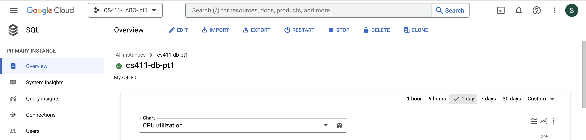
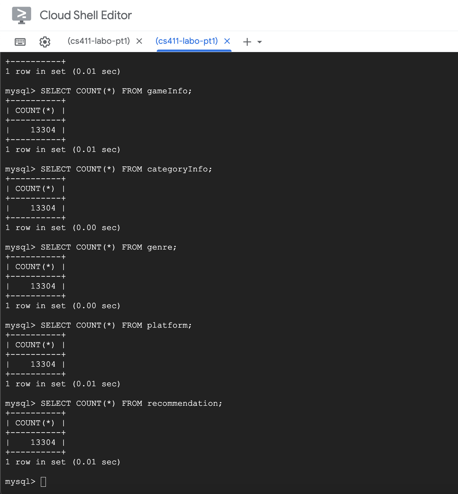

# Database Implementation and Indexing 

## GCP Connection 
We implement Steam Games database via Google Cloud Platform. Below demonstrates the successful connection to the database. 

We used the show tables command to see tables implemented in the databse.

## DDL Commands 

``` SQL
CREATE TABLE UserInfo (
  userID INT PRIMARY KEY,
  userName VARCHAR(255),
  password VARCHAR(255)
);

CREATE TABLE GameInfo (
  queryID INT PRIMARY KEY,
  queryName VARCHAR(255),
  releaseDate XYZ,
  priceFinal FLOAT,
  headerImage VARCHAR(255),
  detailedDescription VARCHAR(10000),
  supportedLanguages VARCHAR(255),
  steamPlayerEstimate INT
);

CREATE TABLE Recommendation (
  recommendationID INT,
  queryID INT,
  recommendationCount INT,
  PRIMARY KEY (reccomendationID, queryID),
  FOREIGN KEY (queryID) REFERENCES GameInfo(queryID) ON DELETE CASCADE
);

CREATE TABLE MyList (
  listID INT,
  queryID INT,
  userID INT,
  PRIMARY KEY (listID, queryID, userID),
  FOREIGN KEY (queryID) REFERENCES GameInfo(queryID) ON DELETE CASCADE,
  FOREIGN KEY (userID) REFERENCES UserInfo(userID) ON DELETE CASCADE
);

CREATE TABLE Reviews (
  commentID INT,
  userID INT,
  queryID INT,
  commentText VARCHAR(1000),
  ratingDate,
  PRIMARY KEY (commentID, queryID, userID),
  FOREIGN KEY (queryID) REFERENCES GameInfo(queryID) ON DELETE CASCADE,
  FOREIGN KEY (userID) REFERENCES UserInfo(userID) ON DELETE CASCADE
);

CREATE TABLE Genre (
  genreID INT,
  queryID INT,
  genrelsIndie BOOLEAN,
  genrelsAction BOOLEAN,
  genrelsAdventure BOOLEAN,
  genrelsCasual BOOLEAN,
  genrelsStrategy BOOLEAN,
  genrelsRPG BOOLEAN,
  genrelsSimulation BOOLEAN,
  genrelsRacing BOOLEAN,
  PRIMARY KEY (genreID, queryID),
  FOREIGN KEY (queryID) REFERENCES GameInfo(queryID) ON DELETE CASCADE
);

CREATE TABLE Platform(
  platformID VARCHAR(255),
  queryID VARCHAR(255),
  platformWindows BOOLEAN,
  platformLinux BOOLEAN,
  platformMac BOOLEAN
  PRIMARY KEY (platformID, queryID),
  FOREIGN KEY (queryID) REFERENCES GameInfo(queryID) ON DELETE CASCADE
);

CREATE TABLE CategoryInfo(
  categoryID VARCHAR(255) [PK]
  queryID VARCHAR(255) [FK to GameInfo.queryID],
  categorySinglePlayer BOOLEAN,
  categoryMultiplayer BOOLEAN, 
  categoryCoop BOOLEAN,
  categoryMMO BOOLEAN
  PRIMARY KEY (categoryID, queryID),
  FOREIGN KEY (queryID) REFERENCES GameInfo(queryID) ON DELETE CASCADE
);
```

## Data Insertation
During this stage, we will focus on game info and its various aspects. We are utilising gameInfo, category, platform, genre, recommendation, and inserting data into these four tables. We will not yet be auto-generating data representing users, reviews, or user-curated lists (myLists), and this will be implemented in the next stage. 


To populate these tables with relevant and comprehensive data, we have sourced our initial dataset from a curated collection on data.world, specifically from the repository "steam-game-data" provided by Craig Kelly (https://data.world/craigkelly/steam-game-data). This dataset includes detailed listings of games offered through Steam, encapsulating a variety of metadata.

As of now, we have successfully inserted a substantial volume of data—13,304 tuples—across these tables, demonstrating the project's progress and the breadth of information being managed. This is a significant milestone indicating that we have a substantial base of game data to work with.




## Advanced SQL Queries
Query-1 -- Popular Games Tendency

```mysql
SELECT 
    g.headerImage,
    g.queryName,
    g.RecommendationCount,
    g.releaseDate,
    g.priceFinal,
    CASE WHEN p.PlatformMac = 'True' THEN 'Support' ELSE 'Not Support' END AS Mac,
    CASE WHEN p.PlatformLinux = 'True' THEN 'Support' ELSE 'Not Support' END AS Linux,
    CASE WHEN p.PlatformWindows = 'True' THEN 'Support' ELSE 'Not Support' END AS Windows
FROM (
    SELECT
        headerImage,
        queryName,
        r.RecommendationCount,
        releaseDate,
        priceFinal,
        g.queryID
    FROM 
        gameInfo g
    INNER JOIN 
        recommendation r ON r.queryID = g.queryID
    WHERE 
        YEAR(STR_TO_DATE(releaseDate, '%b %e %Y')) BETWEEN '1980' AND '2020' -- replace by the time slot the user what to filter
    ORDER BY 
        r.RecommendationCount DESC
    LIMIT 50 -- replace by the number of games the user what to show
) g 
INNER JOIN platform p ON g.queryID = p.queryID;
```

Query-2 -- 'Action' Game price detection

The given SQL query retrieves information about games that belong to the "Action" genre and are available on both Windows and Mac platforms. The information is categorized based on the final price of the game into four distinct categories: "FREE", "Cheap", "Middle", and "Expensive". The query then combines the results of these four categories using the UNION operator to provide a unified list.

```mysql
SELECT DISTINCT queryName, releaseDate, priceFinal, "FREE" AS Price_Status, detailedDescrip, supportedLanguages
FROM gameInfo
JOIN genre USING (queryID) 
WHERE genrelsAction = 'True' AND priceFinal = 0 AND EXISTS (SELECT QueryID 
		FROM platform
		WHERE PlatformWindows = 'True' AND PlatformMac = 'True')

UNION

SELECT DISTINCT queryName, releaseDate, priceFinal, "Cheap" AS Price_Status, detailedDescrip, supportedLanguages
FROM gameInfo
JOIN genre USING (queryID) 
WHERE genrelsAction = 'True' AND priceFinal BETWEEN 1 AND 10 AND EXISTS (SELECT QueryID 
		FROM platform
                WHERE PlatformWindows = 'True' AND PlatformMac = 'True')

UNION

SELECT DISTINCT queryName, releaseDate, priceFinal, "Middle" AS Price_Status, detailedDescrip, supportedLanguages
FROM gameInfo
JOIN genre USING (queryID) 
WHERE genrelsAction = 'True' AND priceFinal BETWEEN 11 AND 15 AND EXISTS (SELECT QueryID 
		FROM platform
		WHERE PlatformWindows = 'True' AND PlatformMac = 'True')

UNION

SELECT DISTINCT queryName, releaseDate, priceFinal, "Expensive" AS Price_Status, detailedDescrip, supportedLanguages
FROM gameInfo
JOIN genre USING (queryID) 
WHERE genrelsAction = 'True' AND priceFinal > 15 AND EXISTS (SELECT QueryID 
		FROM platform
		WHERE PlatformWindows = 'True' AND PlatformMac = 'True')
```

## Indexing Analysis


