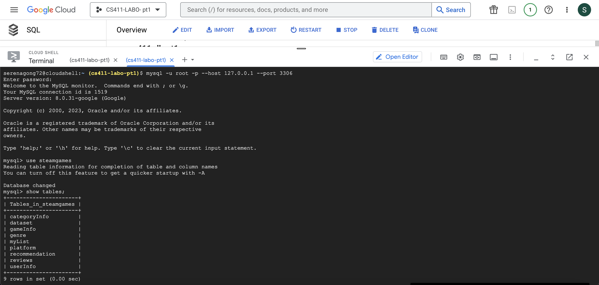

# Database Implementation and Indexing 

## GCP Connection 


## DDL Commands 

``` SQL
CREATE TABLE UserInfo (
  userID INT PRIMARY KEY,
  userName VARCHAR(255),
  password VARCHAR(255)
);

CREATE TABLE GameInfo (
  queryID INT PRIMARY KEY,
  queryName VARCHAR(255),
  releaseDate XYZ,
  priceFinal FLOAT,
  headerImage VARCHAR(255),
  detailedDescription VARCHAR(10000),
  supportedLanguages VARCHAR(255),
  steamPlayerEstimate INT
);

CREATE TABLE Recommendation (
  recommendationID INT,
  queryID INT,
  recommendationCount INT,
  PRIMARY KEY (reccomendationID, queryID),
  FOREIGN KEY (queryID) REFERENCES GameInfo(queryID) ON DELETE CASCADE
);

CREATE TABLE MyList (
  listID INT,
  queryID INT,
  userID INT,
  PRIMARY KEY (listID, queryID, userID),
  FOREIGN KEY (queryID) REFERENCES GameInfo(queryID) ON DELETE CASCADE,
  FOREIGN KEY (userID) REFERENCES UserInfo(userID) ON DELETE CASCADE
);

CREATE TABLE Reviews (
  commentID INT,
  userID INT,
  queryID INT,
  commentText VARCHAR(1000),
  ratingDate,
  PRIMARY KEY (commentID, queryID, userID),
  FOREIGN KEY (queryID) REFERENCES GameInfo(queryID) ON DELETE CASCADE,
  FOREIGN KEY (userID) REFERENCES UserInfo(userID) ON DELETE CASCADE
);

CREATE TABLE Genre (
  genreID INT,
  queryID INT,
  genrelsIndie BOOLEAN,
  genrelsAction BOOLEAN,
  genrelsAdventure BOOLEAN,
  genrelsCasual BOOLEAN,
  genrelsStrategy BOOLEAN,
  genrelsRPG BOOLEAN,
  genrelsSimulation BOOLEAN,
  genrelsRacing BOOLEAN,
  PRIMARY KEY (genreID, queryID),
  FOREIGN KEY (queryID) REFERENCES GameInfo(queryID) ON DELETE CASCADE
);

CREATE TABLE Platform(
  platformID VARCHAR(255),
  queryID VARCHAR(255),
  platformWindows BOOLEAN,
  platformLinux BOOLEAN,
  platformMac BOOLEAN
  PRIMARY KEY (platformID, queryID),
  FOREIGN KEY (queryID) REFERENCES GameInfo(queryID) ON DELETE CASCADE
);

CREATE TABLE CategoryInfo(
  categoryID VARCHAR(255) [PK]
  queryID VARCHAR(255) [FK to GameInfo.queryID],
  categorySinglePlayer BOOLEAN,
  categoryMultiplayer BOOLEAN, 
  categoryCoop BOOLEAN,
  categoryMMO BOOLEAN
  PRIMARY KEY (categoryID, queryID),
  FOREIGN KEY (queryID) REFERENCES GameInfo(queryID) ON DELETE CASCADE
);


